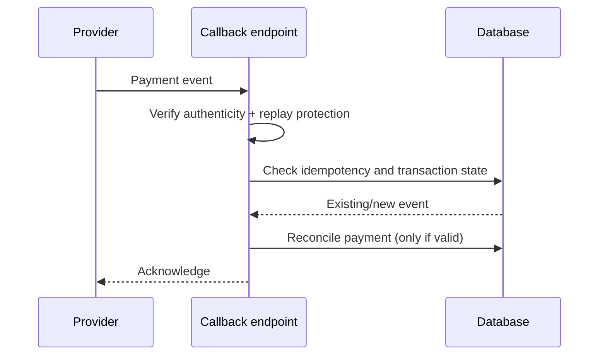

# Payment callback flow — conceptual

```mermaid
sequenceDiagram
  participant Provider
  participant API as Callback endpoint
  participant DB as Database
  Provider->>API: Payment event
  API->>API: Verify authenticity + replay protection
  API->>DB: Check idempotency and transaction state
  DB-->>API: Existing/new event
  API->>DB: Reconcile payment (only if valid)
  API-->>Provider: Acknowledge
```

The verification and idempotency steps are **required design controls**, not yet confirmed implementations.
