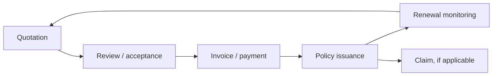

# Insurance policy lifecycle — illustrative

```mermaid
flowchart LR
  Q[Quotation] --> R[Review / acceptance]
  R --> I[Invoice / payment]
  I --> P[Policy issuance]
  P --> N[Renewal monitoring]
  N --> Q
  P --> C[Claim, if applicable]
```

This is a conceptual business flow, **not** a claim that the application enforces these transitions.
